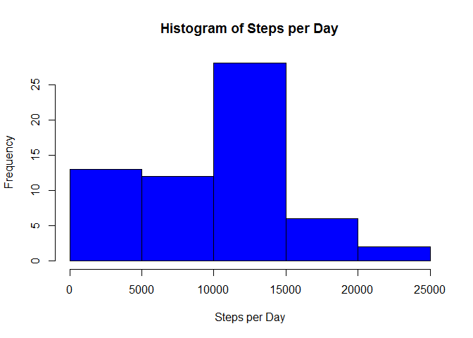
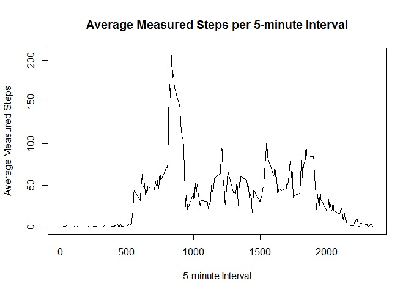
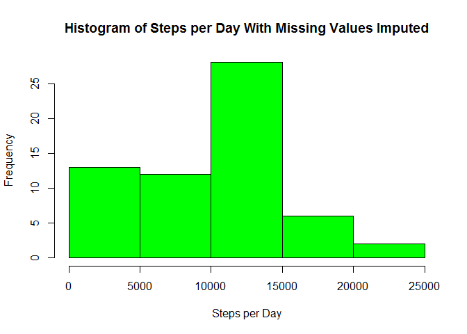
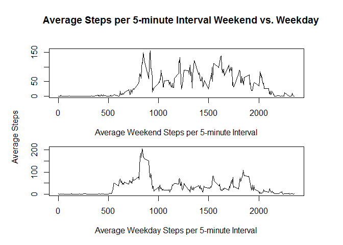

# Reproducible Research: Peer Assessment 1


## Loading and preprocessing the data

Once the working directory is set to point to the folder containing the data, the standard read.csv() is used. The date attribute is coded as a Date object for convenience later.


```r
activity <- read.csv("activity.csv")
activity$date <- as.Date(activity$date)
```

## What is mean total number of steps taken per day?

Using plyr we aggregate the interval measurements into total measured steps per day.  This report was written using an older package of R, thus the warnings below. The processing is unaffected.


```r
require(plyr)
```

```
## Loading required package: plyr
```

```
## Warning: package 'plyr' was built under R version 3.1.3
```

```r
tot_activity <- ddply(activity, .(date), summarize, tot_steps = sum(steps, na.rm = TRUE))
```

From the aggregated data we can directly produce a histogram showing distribution of measured steps each day.

```r
hist(tot_activity$tot_steps, col="blue", xlab = "Steps per Day", main = "Histogram of Steps per Day")
```

 

Similarly, the mean and median of measured steps can be directly calculated.

```r
mean(tot_activity$tot_steps, na.rm = TRUE)
```

```
## [1] 9354.23
```

```r
median(tot_activity$tot_steps, na.rm = TRUE)
```

```
## [1] 10395
```

## What is the average daily activity pattern?
Again using the plyr package we can calculate the mean number of measured steps for each 5-minute interval


```r
interval_activity <- ddply(activity, .(interval), summarize, avg_steps = mean(steps, na.rm = TRUE))
```

Below is a time series plot of the average number of measured steps per 5-minute interval:


```r
plot(interval_activity, type = "l", xlab = "5-minute Interval", ylab = "Average Measured Steps", main = "Average Measured Steps per 5-minute Interval")
```

 

We see a large spike in the 800 range of the plot and can calculate the interval with the maximum average measured steps: 


```r
interval_activity[interval_activity$avg_steps==max(interval_activity$avg_steps),]
```

```
##     interval avg_steps
## 104      835  206.1698
```

## Imputing missing values
Using the original data set we can compute the number of missing values:

```r
sum(is.na(activity$steps))
```

```
## [1] 2304
```

Since activity levels vary across intervals as seen above, it is appropriate to impute missing values using an average of interval measurements.  Moreover, since mean is suceptible to bias due to extreme values we will use the median of the interval to impute the missing value.  This can be seen in the code block below:

```r
imp_activity <- activity
median_steps <- ddply(activity, .(interval), summarize, avg_steps = median(steps, na.rm = TRUE))
imp_activity[is.na(imp_activity$steps),"steps"] <- median_steps[match(imp_activity[is.na(imp_activity$steps),"interval"], interval_activity$interval),"avg_steps"]
```

Recalculating steps per day we see that very little has changed in the overall distribution:


```r
tot_imp_activity <- ddply(imp_activity, .(date), summarize, tot_steps = sum(steps))
hist(tot_imp_activity$tot_steps, col="green", xlab = "Steps per Day", main = "Histogram of Steps per Day With Missing Values Imputed")
```

 

The mean has increased slightly however the median remains unaffected:


```r
mean(tot_imp_activity$tot_steps)
```

```
## [1] 9503.869
```

```r
median(tot_imp_activity$tot_steps)
```

```
## [1] 10395
```

Overall there is little impact from imputing missing values.

## Are there differences in activity patterns between weekdays and weekends?

First we create the new factor in the data set with imputed values:

```r
imp_activity$weekend <- 0
imp_activity[weekdays(imp_activity$date)=="Saturday" | weekdays(imp_activity$date)=="Sunday","weekend"] <- 1
imp_activity$weekend <- factor(imp_activity$weekend, levels=c(0,1), labels=c("weekday","weekend"))
```

We see in the panel plot below that there are very different activity profiles between weekdays and weekends:


```r
weekend_activity <- ddply(imp_activity, .(interval,weekend), summarize, avg_steps = mean(steps, na.rm = TRUE))

par(mfrow=c(2,1), mar=c(4, 0, 1, 1), oma=c(1,5,4,3))
plot(weekend_activity[weekend_activity$weekend=="weekend",c("interval","avg_steps")], type = "l", xlab = "Average Weekend Steps per 5-minute Interval", ylab = "")
plot(weekend_activity[weekend_activity$weekend=="weekday",c("interval","avg_steps")], type = "l", xlab = "Average Weekday Steps per 5-minute Interval", ylab = "")
title(main = "Average Steps per 5-minute Interval Weekend vs. Weekday", ylab = "Average Steps", outer = TRUE)
```

 
